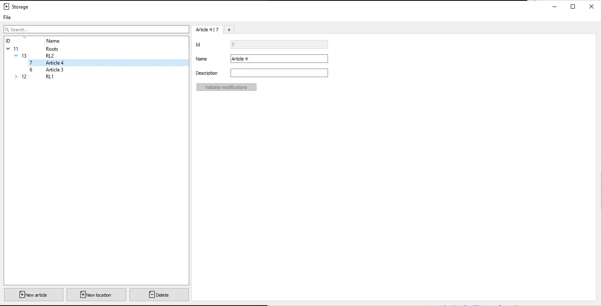
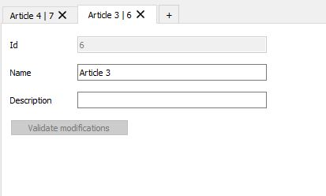

# Gestionnaire d'Articles et d'Emplacements
## Présentation

À l'âge de 9 ans, j'ai entrepris un projet ambitieux de développement logiciel, motivé par ma passion naissante pour l'informatique. Mon objectif était de créer un système de gestion d'articles et d'emplacements, offrant une interface utilisateur conviviale.

Ce projet illustre mon intérêt profond pour les modèles de données : organiser et stocker efficacement des informations est crucial en informatique, notamment à l'ère de l'intelligence artificielle.

## Contexte et Objectifs

En utilisant le langage Python et la bibliothèque PyQt5 pour les interfaces graphiques utilisateur (GUI), j'ai cherché à développer mes compétences en informatique tout en créant un outil fonctionnel et esthétiquement plaisant.

Toutefois, la plupart des fonctionnalités nécessaires à mon application n'étaient pas nativement présentes dans PyQt5. C'est pourquoi j'ai modifié les composants. Ces modifications sont visibles dans le dossier components et en particulier dans les fichiers Tree.py et Root.py.

## Fonctionnalités Clés

J'ai adopté une approche orientée objet pour organiser le code en classes et en modules réutilisables, favorisant la modularité et la maintenabilité du projet.

1. Interface Utilisateur Intuitive : L'interface utilisateur est basée sur une architecture de fenêtres et d'onglets pour une navigation fluide et une organisation optimale des données.

2. Gestion Hiérarchique des Données : Le système permet la gestion hiérarchique d'articles et d'emplacements (ajout, suppression et modification d'éléments). Des algorithmes récursifs s'occupent de parcourir et afficher les données efficacement.

3. Recherche et Filtrage Dynamiques : J'ai implémenté une fonctionnalité de recherche permettant aux utilisateurs de rechercher des articles spécifiques en temps réel.

4. Interaction avec une Base de Données : Le projet intègre des opérations de lecture, d'écriture et de mise à jour de données dans une base de données SQLite (opérations CRUD).

5. Réutilisation de Composants : Les widgets sont personnalisés pour permettre, par exemple, la gestion de l'arborescence des données et des onglets dynamiques.

## Organisation du code

* main.py : Le fichier principal pour exécuter le programme. Il charge les configurations à partir du fichier de configuration JSON, initialise la base de données et lance l'interface utilisateur.

* data.py : Ce module contient la classe DatabaseManager qui gère les opérations sur la BDD telles que la création de tables, l'ajout, la suppression et la modification d'entrées, ainsi que la récupération de données.

* components/ : Ce répertoire contient les différentes composantes de l'interface utilisateur, comme les fenêtres de dialogue pour ajouter des articles ou des emplacements

## Captures d'écran

